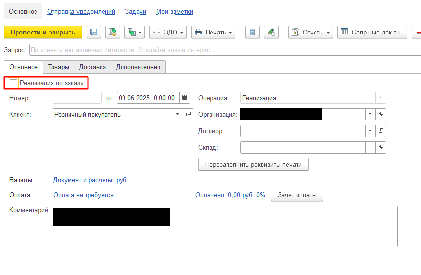
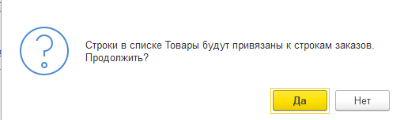
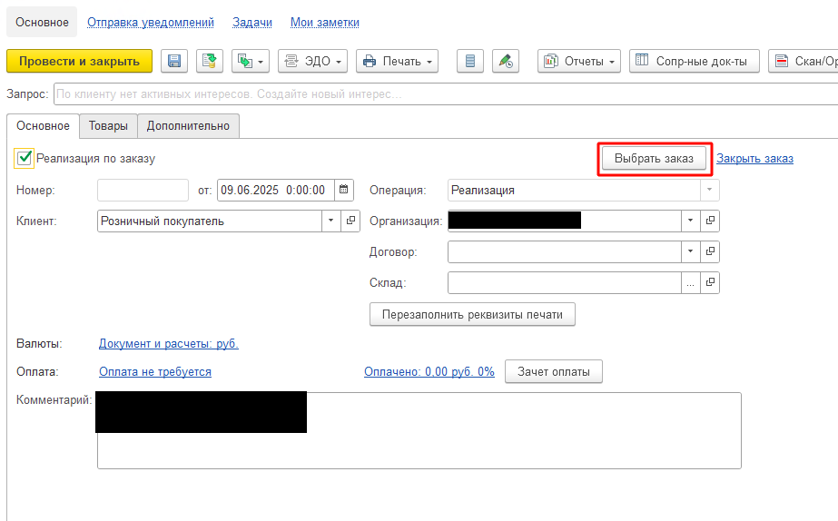
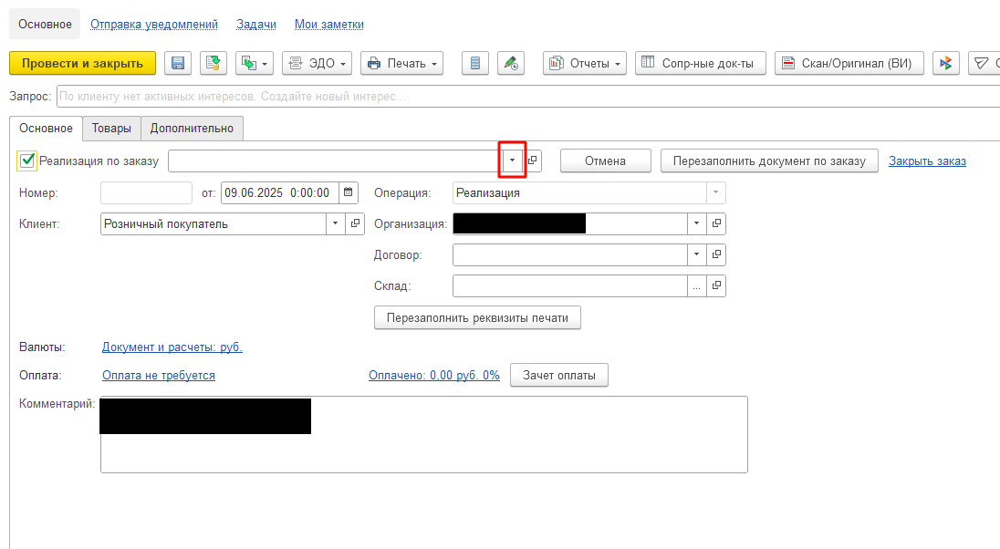
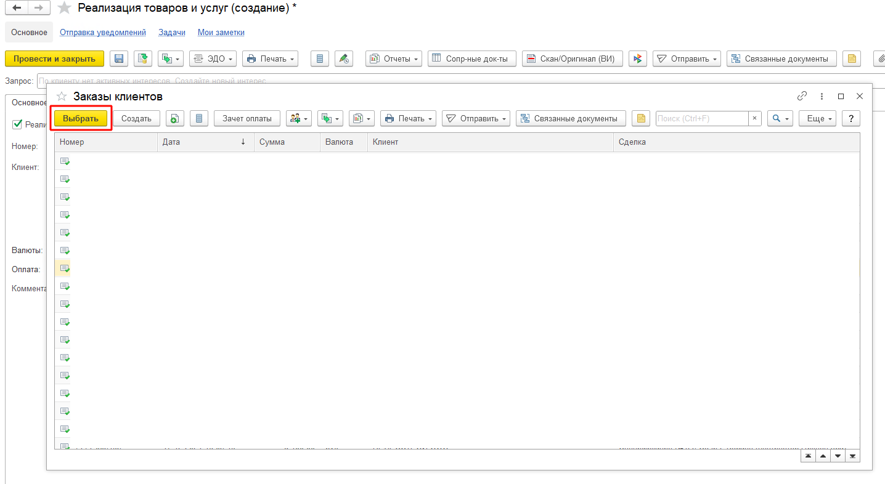
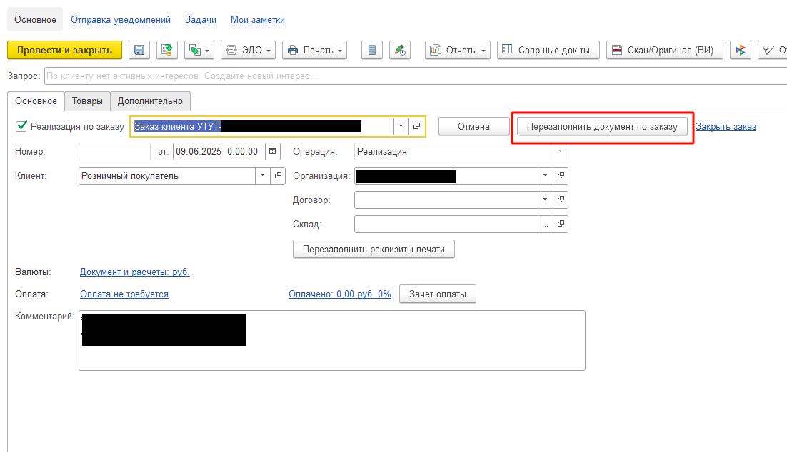
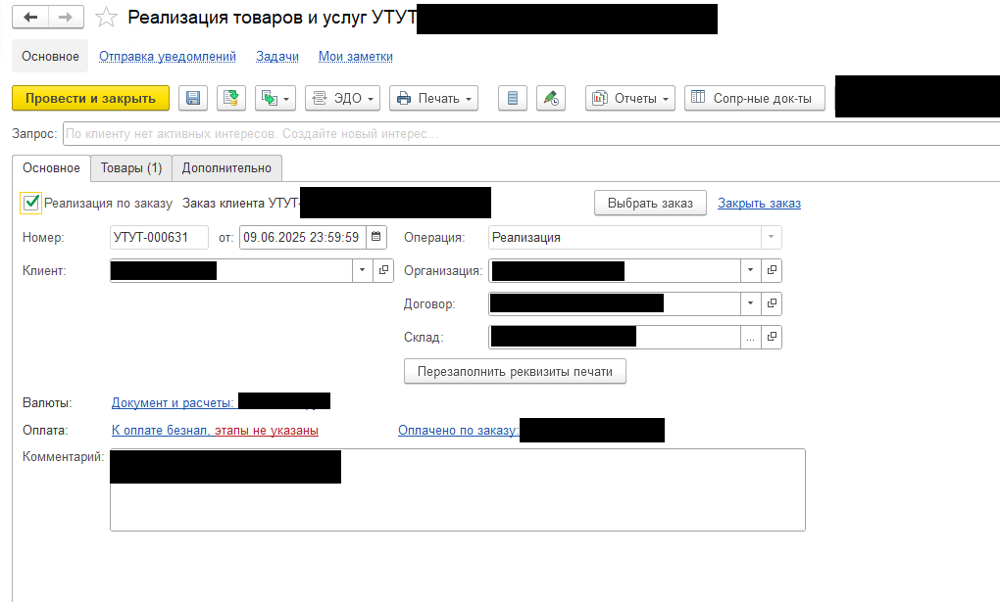

# Инструкция по работе с добавленным функционалом перезаполнения Реализации товаров и услуг

**Система:** 1С:Управление торговлей и взаимоотношениями с клиентами  
**Версия документа:** 1.0  
**Дата:** Июнь 2025  
**Автор:** Емалеев В.С.

---

## Назначение

Данная инструкция описывает процедуру перезаполнения существующего документа «Реализация товаров и услуг» на основе нового заказа клиента.

**Целевая аудитория:** Менеджеры по продажам, специалисты отдела логистики

---

## Содержание

1. [Когда использовать функцию](#когда-использовать-функцию)
2. [Пошаговая инструкция](#пошаговая-инструкция)
3. [Требования к заказу](#требования-к-заказу)
4. [Устранение ошибок](#устранение-ошибок)

---

## Когда использовать функцию

Добавленный функционал перезаполнения позволяет быстро создать новую реализацию на основе данных из заказа клиента без ручного ввода информации.

**Сценарий использования:**
- В соответствие с согласованным процессом клиента, необходимо переназначить реализацию на новый заказ.

---

## Пошаговая инструкция

### Шаг 1. Активация режима работы по заказу

1. Откройте документ «Реализация товаров и услуг»
2. Установите флажок **«Реализация по заказу»**

> **Примечание:** Если реализация уже содержит данные, система запросит подтверждение перезаполнения документа.

### Шаг 2. Подтверждение перезаполнения

При появлении диалогового окна нажмите **«Да»** для продолжения.

> **Важно:** Диалоговое окно не появится, если реализация:
> - не привязана к заказу
> - имеет отметку «создано автоматически»

### Шаг 3. Выбор заказа клиента

1. В открывшемся окне нажмите кнопку **«Выбрать заказ»**
2. Откроется поле для выбора заказа

3. Нажмите на стрелку в поле «Заказ клиента»
4. Выберите **«Показать все»** для отображения полного списка

### Шаг 4. Подтверждение выбранного заказа

1. Найдите нужный заказ в списке
2. Выделите его курсором
3. Нажмите кнопку **«Выбрать»**

### Шаг 5. Перезаполнение документа

1. Убедитесь, что выбран корректный заказ
2. Нажмите кнопку **«Перезаполнить документ по заказу»**

> **Отмена операции:** Для отмены нажмите кнопку **«Отмена»**

### Шаг 6. Проведение документа

После успешного заполнения реализации:

1. Проверьте корректность заполненных данных
2. Нажмите кнопку **«Провести и закрыть»** или **«Провести»**

---

## Требования к заказу

Для корректного перезаполнения реализации заказ клиента должен соответствовать следующим условиям:

### Обязательные условия

| № | Требование | Описание |
|---|------------|----------|
| 1 | Статус заказа | Должен быть «В процессе отгрузки» |
| 2 | Заполнение реквизитов | Все обязательные поля заказа должны быть заполнены |
| 3 | Наличие неотгруженных товаров | В заказе должен быть минимум один товар, не отгруженный по другим реализациям |

---

## Устранение ошибок

### Ошибка при проведении документа

**Причина:** Заказ клиента заполнен некорректно или не соответствует требованиям.

**Решение:**
1. Откройте заказ клиента
2. Проверьте выполнение всех условий из раздела [Требования к заказу](#требования-к-заказу)
3. Внесите необходимые исправления
4. Повторите процедуру перезаполнения

---

## Результат

После выполнения всех шагов инструкции вы получите:
- Документ «Реализация товаров и услуг», заполненный данными из выбранного заказа
- Автоматически перенесенные товарные позиции, готовые к отгрузке
- Корректно проведенный документ, готовый к дальнейшей обработке

---

**Обратная связь:** При возникновении вопросов или предложений по улучшению инструкции обращайтесь к техническому специалисту.